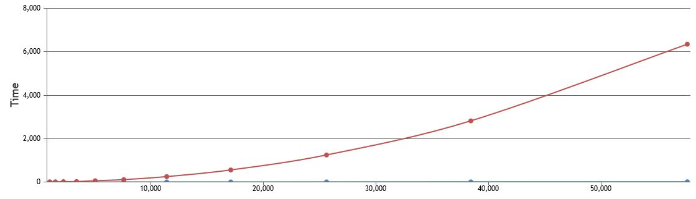
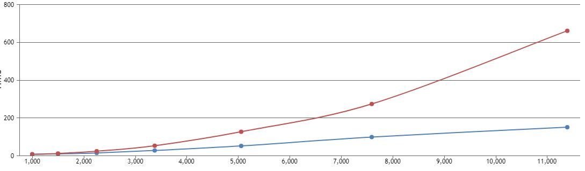
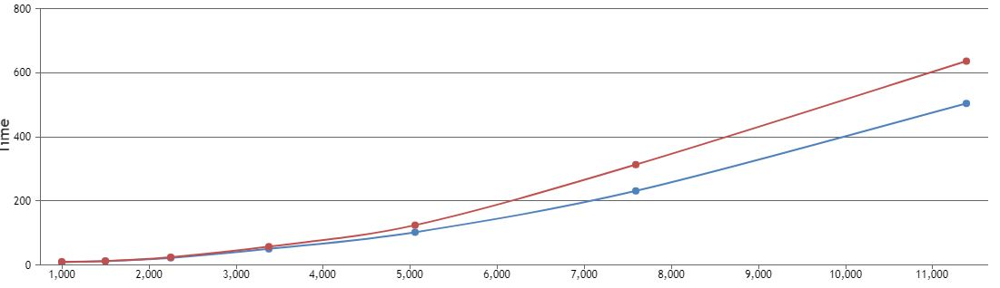

# distinct_array_algorith
Comparing between two algorithms to find unique elemets in an array

Here we have two algorithms to get distinct array (unique items). 

* use **element length** range slider to choose the length of each elemnt at array (form 1 to 4)
* at **Array length** you can set the array length manulay or it will be increased evey submit
* finally, click on **Generate array** to submit this form: as a result, you will see the array generated, and the distinct array that we get with both algorithms

We will get the number of comparisons for each algorithm and execution time.
Also, the size foe generated array and the result array will appears

On the cahrt [array legth, excution time] a point for both will be added every submit
click many tmes on (Generate array) button to see the difference.

## Conclusion:
As lon as we have fewer unique elements, the algorithm 1 becomes faster
But when most or all of elements coms unique they will be similar and complexity (Big O notation) is

* The following chart when most of array elemets are unique

* And here when a lot of them are unique

* But when most of them are unique both algorithms almost have the same efficiency.

